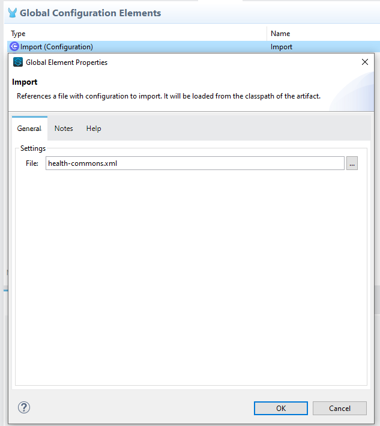
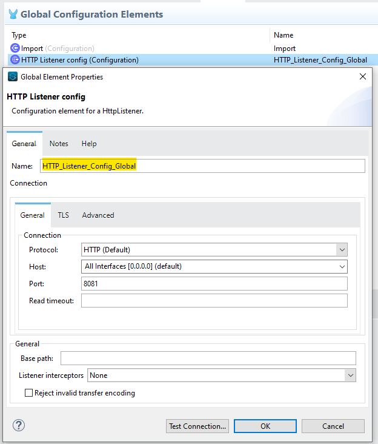
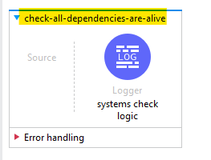

# Health Commons Plugin

Generic plugin for providing API status


## Installation

Change the following values in the pom:

- line 5: `<groupId>GROUPID</groupId>` change the value to your organization's groupID;
- line 85: `<id>ID_M2</id>` change property value by its id value in maven settings.xml file;

    
## Deploy

To deploy this project on the exchange

```bash
  mvn deploy
```


## Usage/Examples

You must import the exchange module


after that, you must import the module file, so that you can use the module flow



you should also create a request config with the following name "HTTP_Listener_Config_Global"



and you should also have a flow in your API with the following name "check-all-dependencies-are-alive". Which must have the systems verification logic



that's it, your health module import has been completed!

